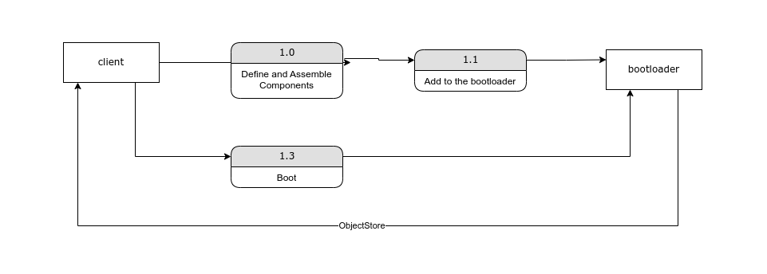

# Buti


Buti is a Python library that is responsible for bootstrapping applications. It offers a set of tools and abstractions that help developers manage the initialization and configuration of different application components in a systematic way.

We can create "bootable" components, each representing a distinct part of your application's setup process. Then, we can
use a boot-loader to coordinate their initialization. This method encourages modularity, reusability, and separation of concerns, making your application more straightforward to develop, test, and maintain. 

Fun Fact: Buti means 'boots' in Swahili


[Example With FastAPI and Beanie ODM](./examples/fastapi_beanie/)

## Overview





***Note:*** in a more complicated scenario, you might want to execute a certain procedure after the application boots, in that case BootableComponent has a *post_boot* method, which will execute after the whole application boots.

## Usage

In this example, we are assuming that we have 2 components:
- config: the application configuration object
- beanie: the database object from Beanie ODM

In this example we are using 1 extra package which is:
- pydantic: using BaseSettings, which will attempt to read from the environment variables, validate and cast as needed; providing us with a clean, and reliable configuration object.

First we define application objects we need to access through the life-cycle, extending the ButiKeys.
```python
class ObjectIds(ButiKeys):
    config: str = "config"
    beanie: str = "beanie"
```

Then we define the ConfigComponent, and the BeanieComponent
```python
from pydantic import BaseSettings
from beanie import init_beanie
from motor.motor_asyncio import AsyncIOMotorClient

from buti import BootableComponent, ButiStore
from components.config import Config

class Config(BaseSettings):
    APP_ENV: str = "development"
    DEBUG: bool = False
    APP_HOST: str
    APP_PORT: int

class ConfigComponent(BootableComponent):
    async def boot(self, object_store: ButiStore):
        config: Config = Config()
        object_store.set(ObjectIds.config, config)

class BeanieComponent(BootableComponent):
    async def boot(self, object_store: ButiStore):
        # get the configuration manager from the store
        config: Config = object_store.get(ObjectIds.config)

        # Initialize the database connection
        beanie_db = AsyncIOMotorClient(config.MONGO_URL).db
        await init_beanie(db=beanie_db, document_models=[])

        # Store the database connection in the ButiStore
        object_store.set(ObjectIds.beanie, beanie_db)
```

Now we are all set, let's boot the application!

```python
import asyncio
from typing import List

from components.beanie import BeanieComponent
from components.config import ConfigComponent

from buti import BootableComponent, BootLoader

# make sure, you add the components in the right order, concerning dependencies
components: List[BootableComponent] = [
    ConfigComponent(),
    BeanieComponent(),
]


async def main():
    # here we can optionally pass a ButiStore
    bootloader = BootLoader()

    bootloader.add_components(components)

    object_store = await bootloader.boot()


asyncio.run(main())
```
